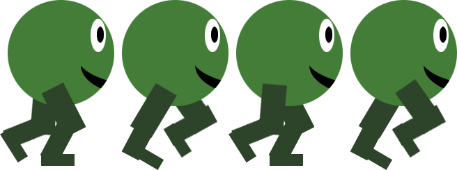

# SpriteSheetCreator
Takes several images as input and returns them side by side in a single image.
Also allows the user to "play" the image sequence, as a way to preview the animation.

# Input

  
  
  
  

# Output

